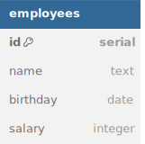

# Database

In this first section, your task is to initialize the database and seed it with data.
You can test your work as you go along with `npm run test:database`.

1. Create a new PostgreSQL database named `fullstack_employees`.
2. In `schema.sql`, write SQL to create an `employees` table according to the following schema.



<details>
<summary>See DBML</summary>

```dbml
table employees {
  id serial [pk]
  name text
  birthday date
  salary integer
}
```

</details>

3. Complete `createEmployee` in `db/queries/employees`.
4. Complete `seedEmployees` in `db/seed.js` to seed the database with at least 10 initial employees.
